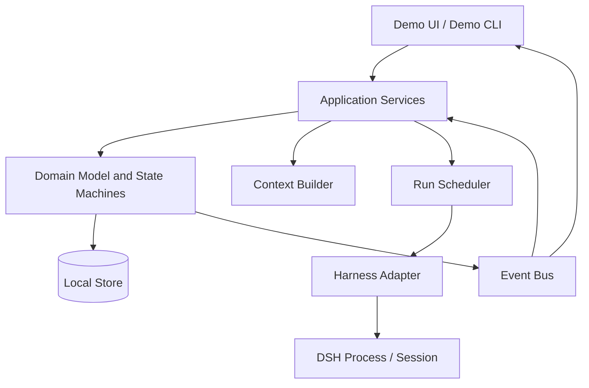
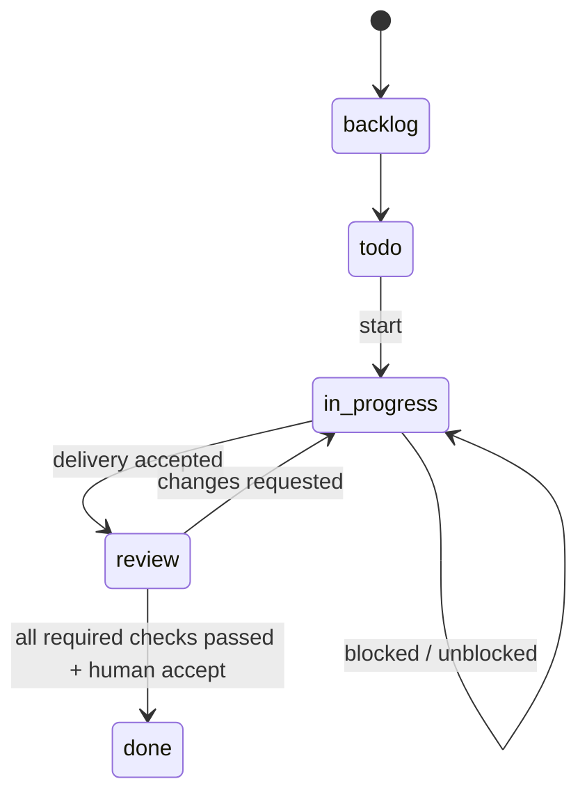
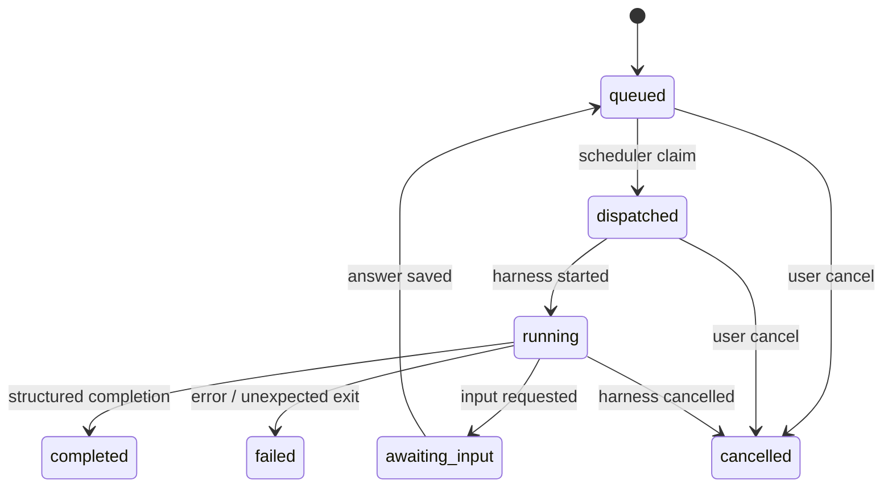
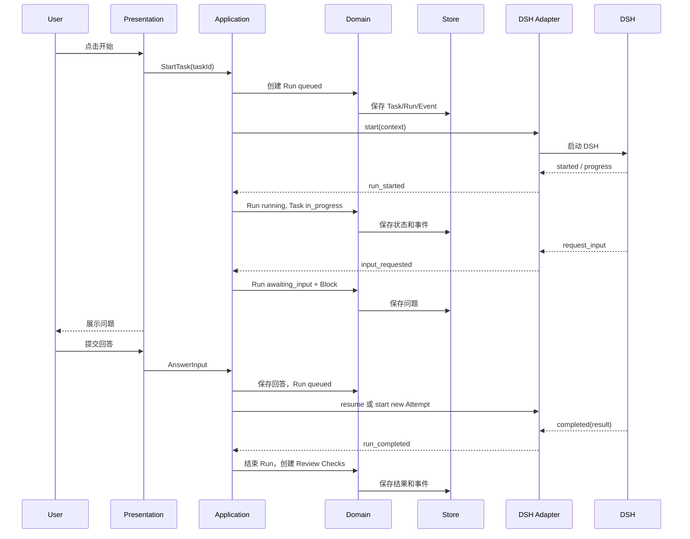

# Kanban DSH Demo 总体架构设计

> 用途：作为独立 Kanban 编排 Demo 的实现约束
>
> 首个执行 Harness：DSH
>
> 范围：单机、单项目、单任务模型；后续可扩展到服务端和多 Runtime
>
> 状态：架构设计

## 1. 架构结论

Demo 采用四层架构：

```text
Presentation
  Demo UI / Demo CLI

Application
  Task Application Service
  Run Scheduler
  Review Coordinator
  Input Coordinator

Domain
  Task / Run / Check / Block / Event
  状态机和业务规则

Infrastructure
  Local Store
  DSH Harness Adapter
  Context Builder
  Process and Session Adapter
```

依赖方向只能从上到下。Domain 不依赖 UI、文件系统、DSH 或具体传输协议；DSH 只能通过 Infrastructure 层的 Adapter 接入。

## 2. 目标和约束

### 2.1 目标

- 让看板阶段只表达任务生命周期；
- 将 Agent 执行、检查结果和阻塞原因独立建模；
- 支持 Agent 提问、用户回答和恢复；
- 支持一个 Task 下多个并行 Review Check；
- DSH 可替换为 Fake Harness，验证 Core 时不依赖真实 CLI；
- 进程重启后能够恢复任务、运行记录和待回答问题；
- 为以后接入父子 Task、多 Runtime 和团队服务端保留边界。

### 2.2 约束

- Demo 不依赖当前 VS Code Kanban 实现；
- Demo 不把 DSH 命令行细节泄漏到 Domain；
- Agent 的自然语言输出不能直接决定 Task 状态；
- 任何成功完成都必须有结构化交接结果；
- DSH 异常退出且没有完成信号时必须判定为失败；
- 不支持原生交互时只能显式降级为新 Attempt，不能伪装成 session resume。

## 3. 逻辑架构



### 3.1 Presentation 层

Presentation 只做展示和用户意图提交：

- 展示五个 Task 阶段；
- 展示 Run、Attempt、Check、Block 和事件时间线；
- 提交开始、取消、重试、回答问题和人工验收；
- 订阅事件并刷新当前视图。

Presentation 不直接调用 DSH，不直接修改 Store，也不能自行推断状态转换。

### 3.2 Application 层

Application 层把用户动作和 Harness 事件转换为领域命令：

- `StartTask`：从 `todo` 创建工作 Run；
- `AnswerInput`：保存回答并恢复待输入 Run；
- `CancelRun`：请求停止 Attempt；
- `RetryRun`：为失败 Run 创建新的逻辑 Run；
- `AcceptTask`：在 Review 门禁通过后将 Task 设为 `done`；
- `HandleHarnessEvent`：处理 DSH 的进度、提问、完成和失败事件。

Application 层负责事务边界和幂等，不负责拼接 DSH 命令行参数。

### 3.3 Domain 层

Domain 层是唯一允许定义业务状态转换的地方。它至少包含：

- Task 生命周期状态机；
- Run 和 Attempt 状态机；
- Check 门禁规则；
- Block 的恢复规则；
- 事件类型和状态变更原因。

Domain 层只接收结构化输入并返回领域事件或错误。它不能执行 IO。

### 3.4 Infrastructure 层

Infrastructure 层实现外部依赖：

- 本地持久化；
- DSH 进程启动和 session 管理；
- Harness 事件解析；
- 上下文文件和工作目录准备；
- 事件总线的进程内实现。

## 4. 核心对象关系

```text
Task 1 ---- * Run
Task 1 ---- * Check
Task 1 ---- * Block history
Task 1 ---- * DomainEvent

Run 1 ---- * Attempt
Run 1 ---- * DomainEvent
Check 0 ---- 1 Run       自动检查通常由一个 Run 产生
Attempt 1 ---- 1 DSH session handle
```

对象语义必须保持如下区别：

| 对象 | 表示 | 不表示 |
| --- | --- | --- |
| Task | 团队要完成的业务目标 | 一次 CLI 进程 |
| Run | 一次逻辑 Agent 介入 | Task 已完成 |
| Attempt | 一次实际 Harness 执行 | 新的业务任务 |
| Check | 一项验证活动及结论 | 看板阶段 |
| Block | 当前无法继续的原因 | 永久失败 |
| Event | 已发生的事实 | 当前状态本身 |

## 5. 状态机

### 5.1 Task 状态机



Task 状态转换必须带有原因和来源，例如 `user_start`、`agent_delivery`、`review_changes_requested`。Agent 不能直接调用“设置 Done”。

### 5.2 Run 状态机



`awaiting_input` 是 Run 的状态，不是 Task 的新阶段。Task 保持原阶段，同时可以附加 `Block(kind=human_input)`。

### 5.3 Check 状态机

```text
pending -> running -> passed
                  -> changes_requested
                  -> failed
                  -> unable_to_run
                  -> cancelled
```

`failed` 和 `changes_requested` 必须区分：前者表示检查器没有成功完成或环境错误，后者表示检查完成且交付需要修改。

## 6. 一次执行的完整时序



## 7. Scheduler 设计

Scheduler 只调度 Run，不调度 Task 阶段。

### 7.1 调度输入

Scheduler 读取：

- `Run.status = queued`；
- Agent 角色和 Harness 类型；
- Task 的工作目录；
- 上一次 Attempt 的恢复信息；
- 当前是否已有同一 Task 的互斥 Run。

### 7.2 调度过程

```text
读取 queued Run
  -> 幂等 claim
  -> 创建 Attempt
  -> Context Builder 生成上下文
  -> Adapter.start/resume
  -> 收到 started 后提交 running
  -> 监听 Adapter 事件
  -> 通过 Application Service 写回 Domain
```

Scheduler 不允许：

- 根据 Agent 的自然语言猜测完成；
- 直接把 Task 推到下一阶段；
- 在 DSH 断开后静默创建新 Run；
- 绕过 Domain 直接写 Store。

### 7.3 幂等和恢复

每个 Harness 事件至少带有 `runId`、`attemptId` 和事件序号。重复事件必须被忽略或安全重放。

进程重启后：

1. Store 找出 `dispatched/running` 的 Attempt；
2. 判断 DSH session 是否仍可恢复；
3. 可恢复则继续原 Run；
4. 不可恢复则关闭旧 Attempt，并按策略创建同一 Run 的新 Attempt；
5. 没有完成事件的异常退出一律上报失败。

## 8. Harness Adapter 和 DSH

### 8.1 Adapter 的职责边界

Adapter 是唯一知道 DSH 细节的模块，负责：

- 可执行文件发现和版本检查；
- 参数、环境变量和工作目录映射；
- DSH 输入输出协议解析；
- session、取消和进程退出处理；
- DSH 事件到统一 HarnessEvent 的转换。

Core 不得导入 DSH SDK，也不得依赖 DSH 特有的 JSON 字段。

### 8.2 统一 HarnessEvent

Adapter 向 Application 层只发送以下事件类别：

```text
started
progress
message
tool_activity
request_input
usage
completed
failed
cancelled
```

事件必须保留原始引用信息，例如 DSH session id 和原始序号，但 UI 不应依赖这些字段来判断业务状态。

### 8.3 能力探测

DSH 接入前执行 capability probe：

```text
stream_events
request_input
send_input
session_resume
cancel
structured_completion
usage
```

能力缺失时由 Adapter 声明降级策略。至少要求 `start`、`events` 和 `cancel`；`request_input`、`send_input`、`session_resume` 可以是可选能力。

## 9. Context Builder

Context Builder 在每个 Attempt 启动前生成上下文快照，不由 UI 拼接。

上下文顺序固定为：

```text
1. 平台协议
2. Agent 角色指令
3. Task 标题、描述和验收标准
4. 当前 Task 阶段、Block 和相关 Check
5. 历史评论、问题回答和前次 Attempt 结果
6. 工作目录和可用工具说明
```

要求：

- 启动时读取最新 Task 内容；
- 恢复时追加回答和前次 Attempt 结果；
- 保存 context revision，便于诊断“Agent 当时看到了什么”；
- 不能把 access token、绝对路径以外的无关本机信息注入上下文；
- 不能让 Agent 通过上下文文本修改授权范围。

## 10. 持久化和事件

第一版使用本地 SQLite 或 JSON Store。推荐 SQLite 作为运行实现，内存 Store 只用于测试。

持久化至少覆盖：

- Task 当前投影；
- Run 和 Attempt 当前状态；
- Check、Block 和问题回答；
- Agent 结构化结果；
- DomainEvent 时间线；
- DSH session 引用和 transcript 路径。

状态投影和事件写入必须在同一个 Application 操作中完成。事件不是替代当前状态的查询接口，而是恢复、审计和 UI 时间线的事实来源。

## 11. Review 协调

当实现 Agent 提交 `completed` 结果时，Review Coordinator 执行：

```text
Run completed
  -> 保存交付结果
  -> Task: in_progress -> review
  -> 创建 automated_test Check
  -> 创建 code_review Check
  -> 为自动 Check 创建 Run
```

两个 Check 可以并行执行。协调器只在所有必需 Check 为 `passed` 后向 UI 提供“可验收”状态；最终 `done` 仍由用户或明确的人工验收命令完成。

测试失败时：

```text
Check changes_requested
  -> Task: review -> in_progress
  -> 创建修复 Run
  -> 修复 Run completed
  -> 重新创建或重新运行相关 Check
```

旧 Check 结果不能被覆盖。重试必须产生新的 Attempt 或新的 Check revision，保留历史事实。

## 12. 错误和取消策略

错误分类至少包括：

```text
validation_error       用户输入或 Task 配置错误
harness_unavailable    DSH 不存在、版本不兼容或启动失败
input_required         Agent 需要人回答
execution_error        DSH 执行失败
unexpected_exit        进程无完成信号退出
store_error            持久化失败
```

规则：

- `input_required` 进入 `awaiting_input`，不算失败；
- `harness_unavailable` 和 `unexpected_exit` 必须让 Run 可见地失败；
- 取消先通知 Adapter，再根据进程结果写入 `cancelled`；
- Store 写失败时不能向 UI 宣称状态已完成；
- 自动重试只适用于明确的瞬时错误，不能重试业务拒绝或人工输入。

## 13. 测试架构

测试按层隔离：

### Domain 测试

- Task、Run、Check 状态转换；
- Block 恢复原阶段；
- 重复事件幂等；
- Review 门禁和 changes requested 回路。

### Application 测试

- StartTask 创建 Run 并调用 Scheduler；
- request_input 保存问题并暂停 Run；
- AnswerInput 恢复同一 Run；
- completed 生成 Check，不直接生成 Done。

### Adapter 测试

- DSH 输出解析为统一事件；
- 进程异常退出；
- 原生输入和 resume 能力；
- 取消和重复事件。

### Contract 测试

Fake Harness 和 DSH Adapter 必须通过同一组 Harness contract tests。替换 Harness 时，Domain 和 Application 测试不应修改。

## 14. 实现顺序

### Phase 1：Domain 和内存 Store

实现 Task、Run、Attempt、Check、Block、Event，以及所有状态转换测试。

### Phase 2：Application 和 Fake Harness

实现 Scheduler、Context Builder、Input Coordinator 和 Review Coordinator；用 Fake Harness 完成“小猫网站”闭环。

### Phase 3：本地持久化和恢复

加入 SQLite/JSON Store、事件时间线和进程重启恢复。

### Phase 4：DSH Adapter

完成 capability probe、真实启动、事件转换、输入、取消和 resume/重启降级。

### Phase 5：最小 UI/CLI

接入五列看板、任务详情、Run/Check 时间线和回答入口。

## 15. 给实现 Agent 的硬约束

实现时必须遵守以下规则：

1. 先实现 Domain 状态机和测试，再接 DSH；
2. 不要把 `testing` 增加为 Task 顶层状态；
3. 不要在 UI、Adapter 或 Scheduler 中直接写 Task 状态；
4. 不要用最终 stdout 是否为空判断 Agent 是否成功；
5. Agent 提问必须产生结构化 `request_input` 事件；
6. 用户回答后优先恢复同一 Run，只有 Adapter 不支持时才创建新 Attempt；
7. DSH 进程异常退出必须产生 `failed`，不能默认 `completed`；
8. Run 完成后进入 Review，并创建 Check，不得自动进入 Done；
9. 所有跨层通信使用接口和统一事件，不传递 DSH 私有对象；
10. 每个状态写入都要有来源、原因和幂等键；
11. 先实现 Fake Harness contract tests，再声称 DSH 已接入；
12. 新增父子 Task、Runtime、Worktree 前，先更新本架构文档和领域边界。

## 16. 完成定义

架构 Demo 只有在以下场景全部可演示时才算完成：

```text
创建“小猫网站” Task
  -> 开始 DSH Run
  -> Agent 提问
  -> 页面刷新后问题仍在
  -> 用户回答，Run 恢复
  -> Agent 提交结构化完成
  -> Task 进入 Review
  -> 测试和代码审查 Check 并行
  -> 测试失败回到 In Progress
  -> 修复后重新 Review
  -> 所有 Check 通过
  -> 人工确认后 Done
```

这条路径证明的是架构边界和状态语义，不代表已经实现 Multica 式父子任务编排。父子 Task、Stage、Runtime 和团队协作应在该 Demo 稳定后作为独立扩展设计。
